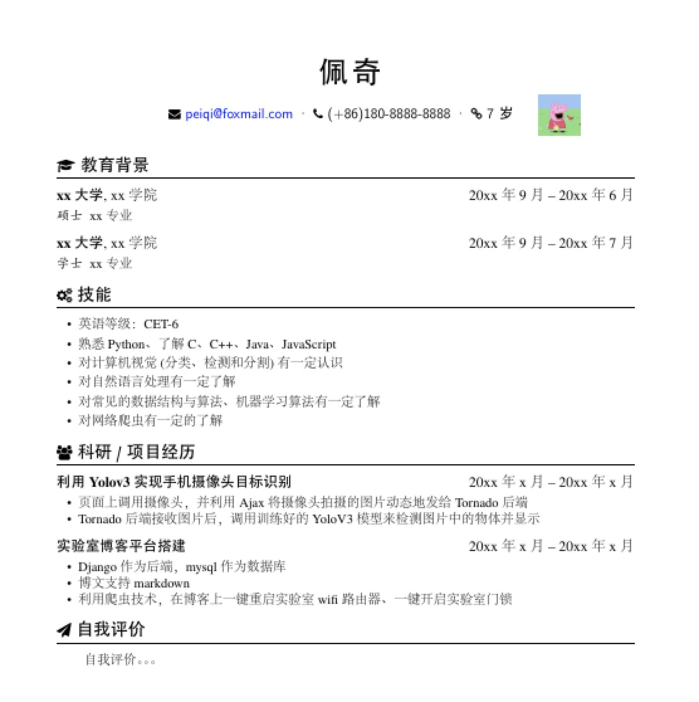

# resume-in-latex
个人简历
环境：ubuntu20

安装texlive
```
sudo apt install texlive-xetex
```

安装texstudio
```
在ubuntu software中搜索texstudio，并安装
```

配置texstudio
```
options -> configure TeXstudio -> build -> default builder -> XeLaTex
```

编译简历[pdf](resume-zh_CN.pdf)
```
git clone https://github.com/lturing/resume-in-latex.git

打开texstudio，并点击 File -> Open -> 选择resume-in-latex文件夹下的resume-zh_CN.tex

点击texStudio中的Build & View，生成简历pdf版

```

简历效果



可能遇到的字体问题
```
将resume-in-latex文件夹下的fonts/zh_CN-Adobe按照以下步骤安装
cd fonts/zh_CN-Adobe
sudo mkdir /usr/share/fonts/AdobeFangsongStd-Regular
sudo cp fonts/zh_CN-Adobe/AdobeFangsongStd-Regular.otf /usr/share/fonts/AdobeFangsongStd-Regular 
cd /usr/share/fonts/AdobeFangsongStd-Regular 
sudo chmod 744 *
sudo mkfontscale
sudo mkfontdir

cd -
sudo mkdir /usr/share/fonts/AdobeHeitiStd-Regular
sudo cp fonts/zh_CN-Adobe/AdobeHeitiStd-Regular.otf /usr/share/fonts/AdobeHeitiStd-Regular
cd /usr/share/fonts/AdobeHeitiStd-Regular
sudo chmod 744 *
sudo mkfontscale
sudo mkfontdir

cd -
sudo mkdir /usr/share/fonts/AdobeKaitiStd-Regular
sudo cp fonts/zh_CN-Adobe/AdobeKaitiStd-Regular.otf /usr/share/fonts/AdobeKaitiStd-Regular
cd /usr/share/fonts/AdobeKaitiStd-Regular
sudo chmod 744 *
sudo mkfontscale
sudo mkfontdir

cd -
sudo mkdir /usr/share/fonts/AdobeSongStd-Light
sudo cp fonts/zh_CN-Adobe/AdobeSongStd-Light.otf /usr/share/fonts/AdobeSongStd-Light
cd /usr/share/fonts/AdobeSongStd-Light
sudo chmod 744 *
sudo mkfontscale
sudo mkfontdir

sudo fc-cache -fv

```
